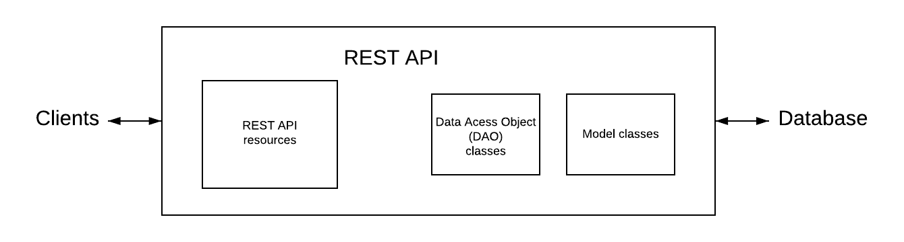
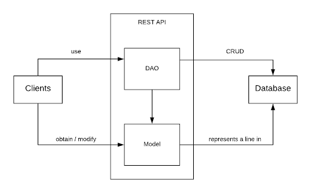
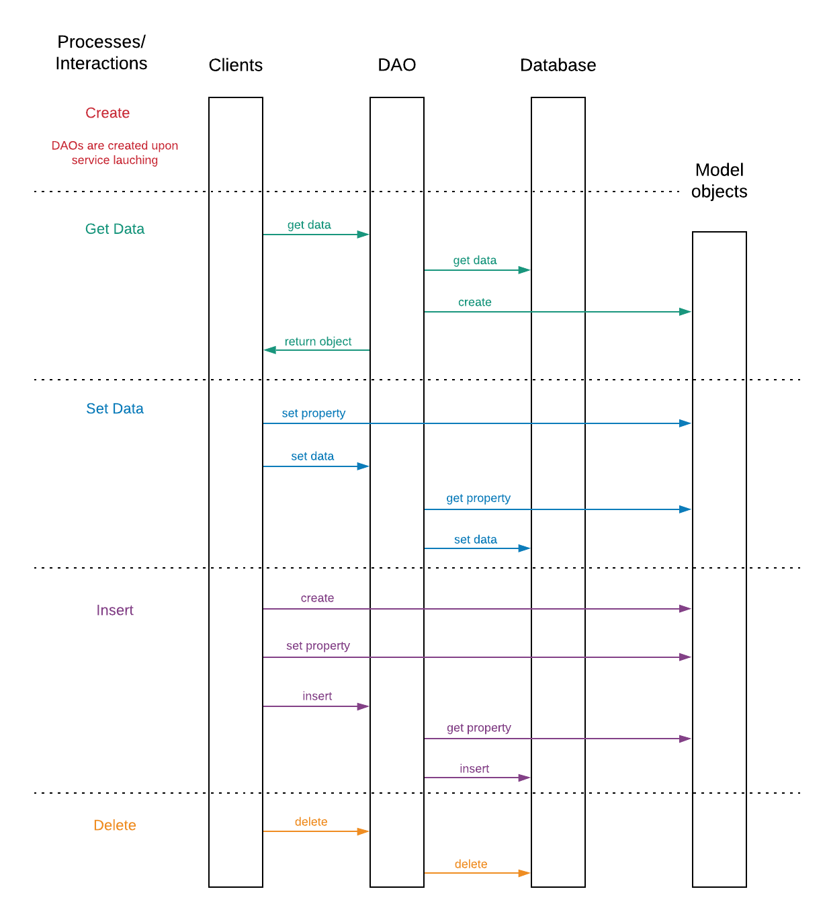

The REST API will play a very important role in the system. It will contain most of the business logic for the system and provide a common language for interacting with the data. The Data Access Object (DAO) design pattern is used in our REST API, as shown in the diagram below.

<figure>
  
  <figcaption>DAO Design Pattern in REST API component.</figcaption>
</figure>

## DAO

For each concept we have in our database, such as owner and pet, we will have a model class. For each model class, we will have a corresponding DAO class. On one side, the DAOs set up connections with the database and interact with it by sending SQL CRUD commands. And on the other side, they communicate with clients to provide and obtain data. The following diagram shows the relationships between components in DAO pattern.

<figure>
  
  <figcaption>DAO component relationships in the REST API component.</figcaption>
</figure>

Client-DAO: By sending requests in the format “(baseURL)/api/(endpoint)”, clients interact with DAOs on the REST API server to get or post data.

Client-Model: Clients obtain, modify, and sometimes create model objects. They usually obtain model objects to display the information to users; modify model objects when users update the information; create model objects when there are new instances created by users to be inserted into database.

DAO-Database: DAO classes implement methods that handle the requests from clients. Upon calling, they will set up a connection with the database, prepare the command with, if any, parameters passed in, and execute the command.

DAO-Model: DAO creates model object(s) after reading from the database. DAO reads from model object(s) when the properties of them get updated or they are newly created and need to be inserted to the database.

Model-Database: Different model classes represent different concepts in the database. Each model object represents a line in the database.

The following diagram presents the interactions between clients and database through the DAO pattern. Upon the service launches, DAOs are created and ready to communicate with both the clients and the database. The clients can get, set, insert, and delete data without any knowledge of the implementation of the database.

<figure>
  
  <figcaption>Sequence of interactions between client, DAO, and the database.</figcaption>
</figure>

## DAO Operations

Get data (SELECT):
- Client sends request to the REST API
- DAO process the request, prepare and execute the SQL statement, and get data from database
- After receiving data from the database, DAO creates a model object (or a list of model objects, depending on the type of request)
- Finally, DAO returns the model object(s) created to the client

Set data (UPDATE):
- Client changes the property of a model object it received earlier from the REST API
- Then the client sends requests to the REST API to update data
- DAO reads the updated information from the model object
- Finally, DAO prepares and executes an UPDATE statement and changes the data in database

Insert (INSERT):
- Client creates a new instance of model (usually when new accounts open or new records are generated)
- Client sets the properties of the model object according to the new record
- Client sends an insert request to the REST API
- DAO reads the information in the newly created model object
- DAO prepares and executes an INSERT statement and therefore insert the data into database

Delete (DELETE):
- Client sends a request to delete some information
- DAO prepares and execute a DELETE statement to remove the corresponding data in database

## Platform

To host the API, we will use Amazon Elastic Cloud Compute (EC2) with Auto Scaling. With auto scaling, we can dynamically scale compute performance to meet demand, which will satisfy NR-3 and NR-4

## API Endpoints

For the initial set of requirements all of the REST API endpoints should be private or protected in some way. We do not want to allow any anonymous source to access the API.

API endpoints examples (not an exhaustive list):

<table>
  <thead>
    <tr>
      <th>API Endpoint</th>
      <th>Method</th>
      <th>Description</th>
      <th>Authorization Control</th>
    </tr>
  </thead>
  <tbody>
    <tr>
      <td>/user/login</td>
      <td>POST</td>
      <td>Accepts user credentials and issues time sensitive API token. (FR-5)</td>
      <td>No</td>
    </tr>
    <tr>
      <td>/user/register</td>
      <td>POST</td>
      <td>Processes registration form for all types of users. (FR-1 and FR-2)</td>
      <td>No</td>
    </tr>
    <tr>
      <td>/user/:id</td>
      <td>GET</td>
      <td>Fetches details about a user.</td>
      <td>Yes</td>
    </tr>
    <tr>
      <td>/user/:id</td>
      <td>POST</td>
      <td>Updates a user’s details.</td>
      <td>Yes</td>
    </tr>
    <tr>
      <td>/user/:id/pets</td>
      <td>GET</td>
      <td>Fetches details about a user’s pets</td>
      <td>Yes</td>
    </tr>
    <tr>
      <td>/clinic</td>
      <td>GET</td>
      <td>Search for clinics.</td>
      <td>Maybe</td>
    </tr>
    <tr>
      <td>/clinic/:id</td>
      <td>GET</td>
      <td>Fetch details about a clinic.</td>
      <td>Maybe</td>
    </tr>
    <tr>
      <td>/clinic/:id/employee</td>
      <td>GET</td>
      <td>Fetch list of clinic employees</td>
      <td>Yes</td>
    </tr>
    <tr>
      <td>/clinic/:id/employee/:id</td>
      <td>GET</td>
      <td>Fetch details about a clinic employee</td>
      <td>Yes</td>
    </tr>
    <tr>
      <td>/clinic/:id/employee/:id</td>
      <td>POST</td>
      <td>Update details about a clinic employee. (FR-4)</td>
      <td>Yes</td>
    </tr>
    <tr>
      <td>/clinic/:id/employee/create</td>
      <td>POST</td>
      <td>Allow business users to create employee accounts. (FR-3)</td>
      <td>Yes</td>
    </tr>
    <tr>
      <td>/pet</td>
      <td>GET</td>
      <td>Search for pets.</td>
      <td>Yes</td>
    </tr>
    <tr>
      <td>/pet/:id</td>
      <td>GET</td>
      <td>Fetch general information about a specific animal</td>
      <td>Yes</td>
    </tr>
    <tr>
      <td>/pet/:id/vaccine</td>
      <td>GET</td>
      <td>Fetch vaccine history for a specific animal</td>
      <td>Yes</td>
    </tr>
    <tr>
      <td>/pet/:id/vaccine</td>
      <td>POST</td>
      <td>Update vaccine history for a specific animal</td>
      <td>Yes</td>
    </tr>
    <tr>
      <td>/pet/:id/record</td>
      <td>GET</td>
      <td>List of medical records associated with a pet.</td>
      <td>Yes</td>
    </tr>
    <tr>
      <td>/pet/:id/record</td>
      <td>POST</td>
      <td>Add a new medical record for the pet.</td>
      <td>Yes</td>
    </tr>
    <tr>
      <td>...</td>
      <td>...</td>
      <td>...</td>
      <td>...</td>
    </tr>
  </tbody>
</table>

  Notes:
  <ol>
    <li>‘:name’ are placeholders for dynamic values.</li>
    <li>All POST endpoints require a payload.</li>
    <li>Authorization control indicates additional security checks to verify a user can access or modify the requested resource.</li>
  </ol>

[1] <a href="https://www.oracle.com/technetwork/java/dataaccessobject-138824.html">https://www.oracle.com/technetwork/java/dataaccessobject-138824.html</a>

