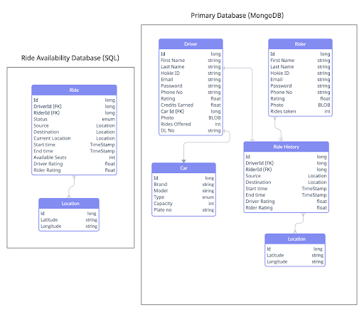

Databases are core components of many software systems, particularly web-based systems. There are several popular types of databases: relational, key-value, and document based. Each has their own set of advantages and challenges. The file storage component exists to store the semi-structured and unstructured data, but there is additional structured data that the system will need to capture. A relational database is ideal for structured data. Using a relational model we can easily identify all of the actors in the system, the data the system needs to capture, and the relationships between the actors and data.

Relational models provide several features that we will make heavy use of. Most entities defined in the data model will have a numeric identifier as the primary key. This identifier will be automatically generated by the database and will not expose additional details about the entity it represents. Some entities will relate to other entities, this will be accomplished using the identifiers and a foriegn key constraint. There will be special rules for some of the data stored in the system to ensure data integrity, additional constraints will be defined to enforce those rules. Finally, efficient retrieval of the data is necessary. For this we will define the necessary indices on the data.

<figure>
  
  <figcaption>Prototype of database table design.</figcaption>
</figure>

For database hosting, we will be utilizing Amazon Aurora due to its excellent pricing and performance relative to other cloud providers. Additionally it can auto scale up to 64 terabytes per instance