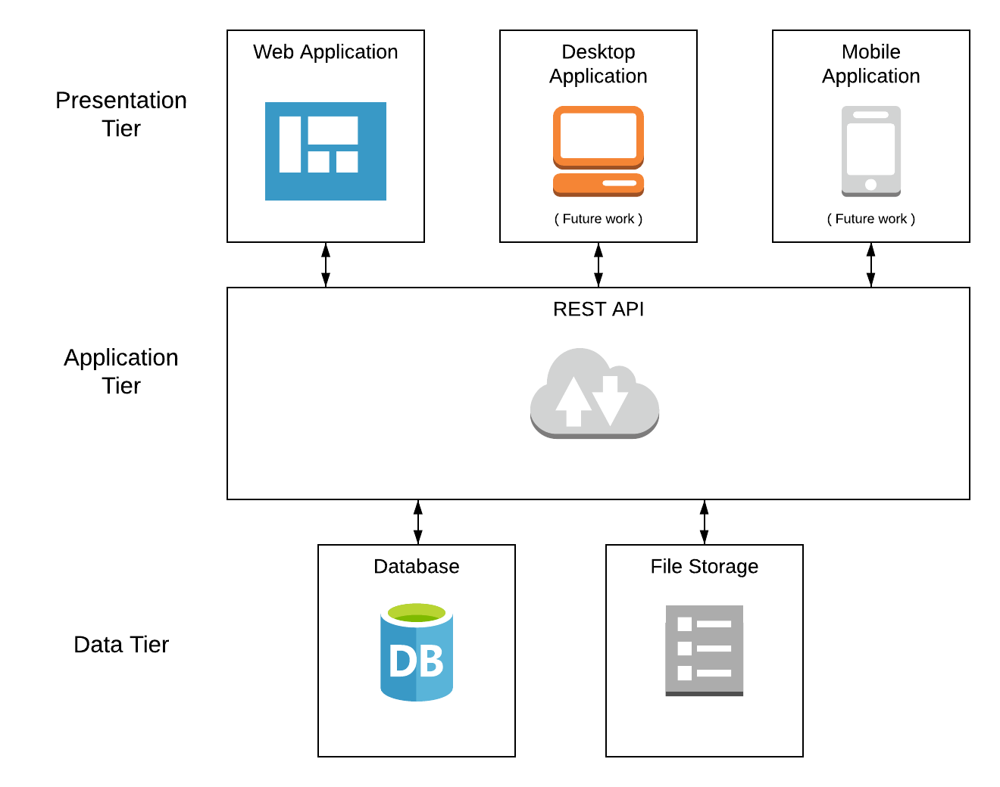

Based on the requirements of the system, we have identified four core modules and two modules that may be completed at a future date. The four core modules are: database, document storage, REST API, and a web application. The two additional modules are: a desktop application and a mobile application. Using a multi-tier architecture each of these six modules fall within one of three tiers. The data tier is responsible for storage and retrieval of the data. This tier includes the database and document storage module. The application tier is responsible for all of the business logic, including authorization and access control. This tier is made up entirely of the REST API. The presentation tier provides external interface for the system. This tier includes the web application, the desktop application, and the mobile application. Each of the applications in the presentation tier communicates with the REST API in the application tier and the REST API communicates with both the database and data storage modules in the data tier.

<figure>
  
  <figcaption>Three-tier architecture: Presentation Tier, Application Tier, and Data Tier.</figcaption>
</figure>

The following sections will go into depth of the design of the four core components. All of the decisions that were made were directly or indirectly in support of the functional and non-functional requirements. Specifically, we have made the decision to target Amazon Web Services (AWS) products to satisfy <abbr title="The full application stack should be cloud compatible.">NR-2</abbr>, <abbr title="The full application stack should autoscale to meet user demand.">NR-3</abbr>, <abbr title="The application should be available 99.99% of the time (“four nines”).">NR-4</abbr>. Where possible the implementation should target industry standards while also maintaining support the the specified AWS products.