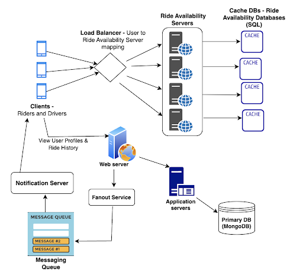

<figure>
  
  <figcaption>System Architecture Diagram</figcaption>
</figure>

The above diagram represents the high level design of HokieRide application. Load balancers will be used to redirect and distribute the traffic to web servers. Web servers would route requests to various application servers like Ride Availability servers, Notification servers, etc. Fanout service would push the data requested or the available rides data to the messaging queue. Cache DBs would be used to store ride availability data for fast retrieval and querying of active rides data. Notification requests from messaging queues would be processed by Notification server and delivered across various channels.

