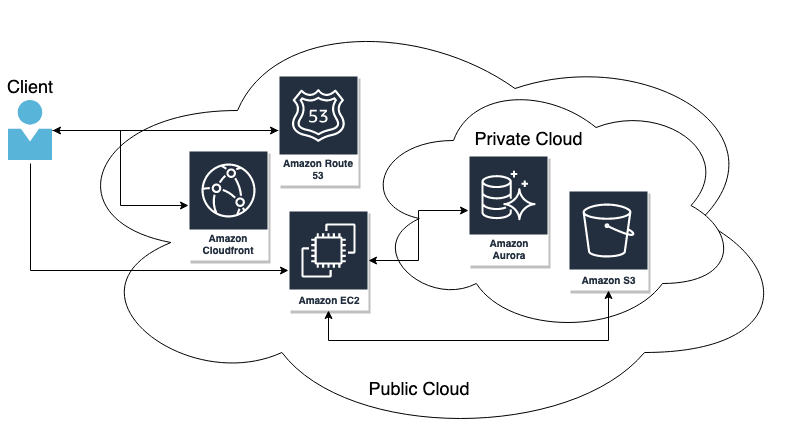

With this approach there are several benefits, the first being that since there is only one page that is used and rewritten depending on user actions, the page does not need to be reloaded when navigating between different pages,which will ensure an uninterrupted user experience  and function like a standard desktop application. Additionally, the web page is only loaded once and all necessary code (HTML, CSS, JavaScript) is only loaded on the first page load or as needed based on user interactions. This will reduce server load at any given point and shorten page loads, which also aids in improving the user experience and fulfill <abbr title="All web pages should load in under two seconds.">NR-5</abbr>.

The front end of the application itself will be written using React, which is a JavaScript library designed for building user interfaces (view layer). The app will be broken into various components, which are self-contained modules, which will accelerate development and allow for easy reuse across the entire application. Since React uses a virtual DOM, it is very fast and efficient when loading different views and allows applications to work well on different operating systems and devices, including mobile which will also be a critical component of our system. Since our application is very large and complicated, it will be difficult to manage the various application states, which is why we will also incorporate Redux. Redux is a very lightweight open-source JavaScript library that makes managing application state simple. This will aid us in making sure that we are displaying the correct information to the user at all times, as well as ensure that the application is responding appropriately to user actions.

There are several other technologies that will be incorporated into the application. We will be using Amazon CloudFront, which is Amazon’s Content Delivery Network (CDN). Their network spans all counties and has several features to reduce page load times.

<figure>
  
  <figcaption>Client request for resources is routed using Route 53. The SPA resources are loaded from CloudFront. The client makes additional requests to the REST API on an EC2 instance, which communicates with data sources.</figcaption>
</figure>
